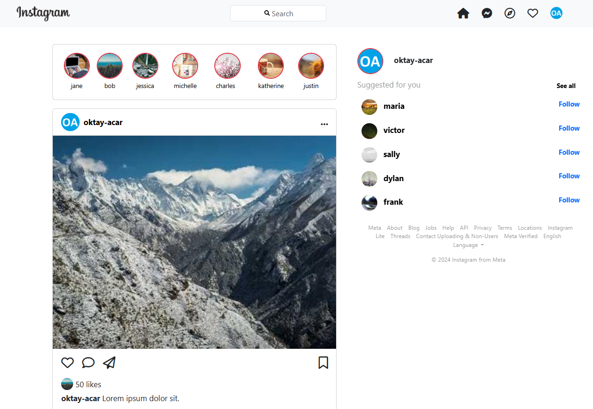

# Instagram Homepage Clone

## Description

A simple **Instagram clone** created with HTML, CSS, and Bootstrap.

- **Bootstrap Version:** [5.3.3](https://getbootstrap.com/docs/5.3/getting-started/introduction/)
- **Image Source:** [Lorem Picsum](https://picsum.photos/)

## Screenshot

The screenshot shows only a portion of the web page.

|             **Instagram Homepage Clone**              |
| :---------------------------------------------------: |
|  |

---

## License

This repository is licensed under the [MIT License](https://github.com/oktay-acar/instagram-clone/blob/main/LICENSE).

## Author

[Oktay Acar](https://github.com/oktay-acar)
